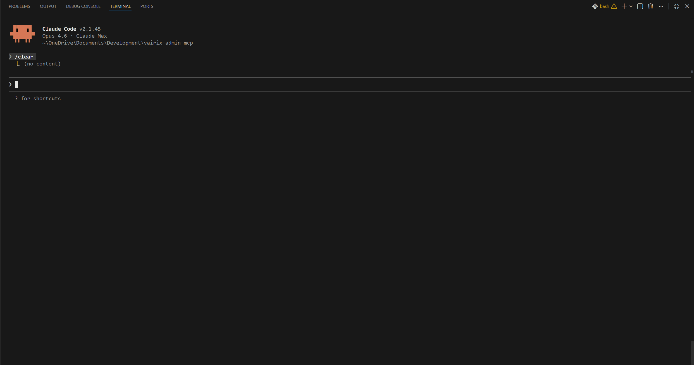

<div align="center">


[](https://nodejs.org)
[](LICENSE)
[](https://modelcontextprotocol.io)

</div>

<div align="center">

### Talk to Claude. Your hours get logged.

An [MCP server](https://modelcontextprotocol.io) that gives Claude direct access to [Vairix Admin](https://admin.vairix.com).<br>
No more clicking through forms -- just describe what you need in plain language.

</div>

---



---

## Install

One command. That's it.

```console
$ claude mcp add vairix-admin -s user -- npx --yes github:Barralex/vairix-admin-mcp
```

> `-s user` makes it available across **all** your projects, not just the current one.

<details>
<summary>Clone manually instead</summary>

```console
$ git clone git@github.com:Barralex/vairix-admin-mcp.git
$ cd vairix-admin-mcp
$ npm install
$ claude mcp add vairix-admin -s user -- node $(pwd)/build/index.js
```

</details>

<details>
<summary>Uninstall</summary>

```console
$ claude mcp remove vairix-admin -s user
```

</details>

## How it works

```
You: "Log 8 hours on Seekr for today: API refactor"
                          |
                    Claude Code (MCP)
                          |
               admin.vairix.com (HTTP)
                          |
                       Done.
```

**First time?** Claude will open your browser (Chrome, Edge, or Brave) so you can login normally. Your session cookies are stored in the OS keychain -- passwords are **never** saved. After that, everything runs via direct HTTP requests. Sub-second. No browser needed.

Session expired? Just say _"authenticate"_ again.

## What you can say

```
"Authenticate with Vairix Admin"              -- login (once per session)

"What days am I missing this month?"           -- find gaps
"Log 8h on Seekr for Monday through Friday"    -- bulk log
"Log 4 hours on Cordage for today: Bug fixes"  -- single entry

"How many hours did I log on Seekr?"           -- totals
"Show me a breakdown by category"              -- summary
"Show my hours for this month"                 -- list entries

"Delete the hour entry from today"             -- remove entry
```

No special syntax. No commands to memorize. Just describe what you want.

## Tools under the hood

Claude picks the right tool automatically. You don't need to call them directly.

| Tool | What it does |
|:-----|:-------------|
| **`auth`** | Opens your browser for login. Session saved to OS keychain. |
| **`auth_status`** | Checks if your session is still valid. |
| **`logout`** | Clears saved session. |
| **`set_main_project`** | Sets your default project so you don't have to specify it every time. |
| **`get_pending_days`** | Finds workdays where you haven't logged hours yet. |
| **`get_hours`** | Lists your entries. Filter by project, date range, or scope. |
| **`get_hours_summary`** | Totals and breakdowns by project, category, or date. |
| **`get_projects`** | Shows which projects you can log to. |
| **`create_hours`** | Logs hours for one or more dates at once. |
| **`delete_hours`** | Removes an entry by ID. |

## Security

Your credentials are handled carefully:

- **Passwords** are never stored. You login through your real browser.
- **Session cookies** live in your OS keychain (macOS Keychain / Linux libsecret / Windows Credential Vault).
- **No bundled browser**. Uses your existing Chrome, Edge, or Brave.

## Troubleshooting

| Problem | Solution |
|:--------|:---------|
| "No Chromium-based browser found" | Install Chrome, Edge, or Brave. |
| "Not authenticated" | Say _"authenticate with Vairix"_. |
| "Session expired" | Same -- just authenticate again. |
| Hours creation fails | Check the error. Admin validates dates (no future dates, etc). |

## Development

```console
$ npm run dev          # watch mode
$ npm run build        # compile
$ npm test             # run tests
$ npm start            # run server
```

## Requirements

- Node.js >= 18
- Chrome, Edge, or Brave
- [Claude Code](https://docs.anthropic.com/en/docs/claude-code) CLI

<div align="center">

---

**[Vairix](https://vairix.com)** | MIT License


</div>
